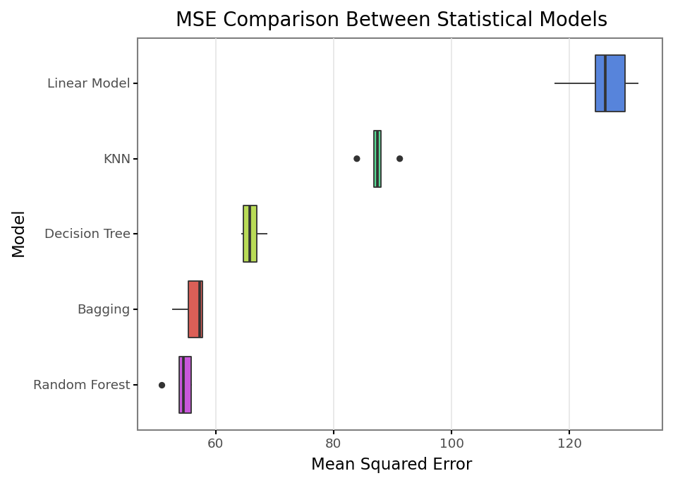
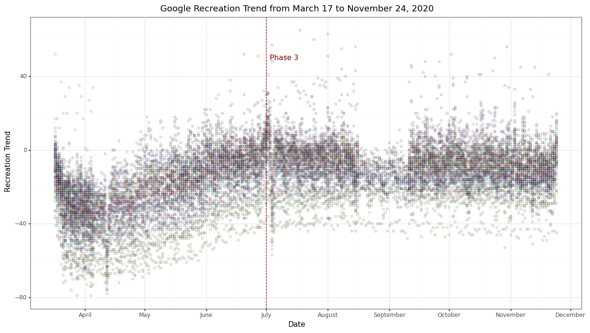
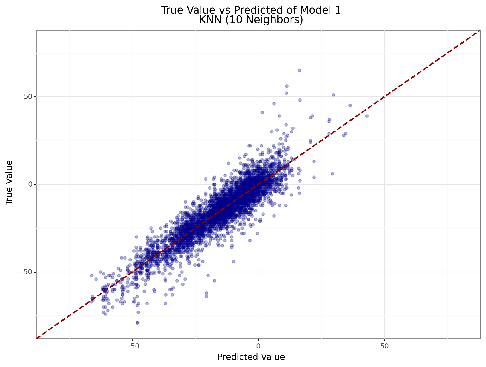
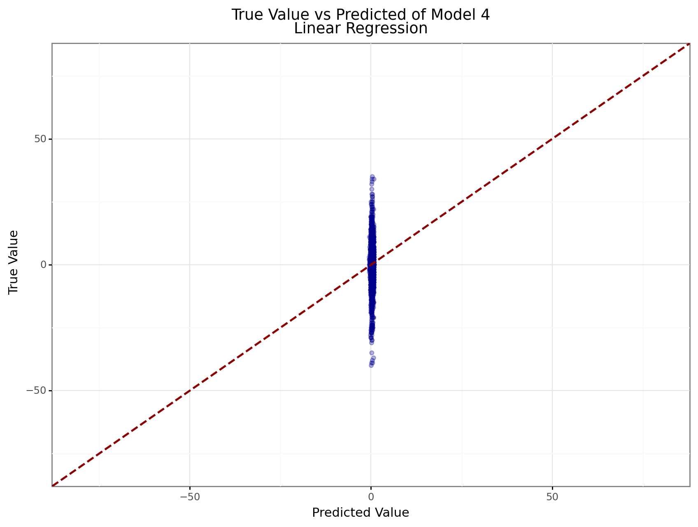

### Introduction

|    This project aims to understand and explore the effects of the COVID-19 pandemic on a community’s behavior. Undoubtedly, the daily lives of Americans have undergone drastic change since this virus infected the country, making masks a regular article of clothing, enforcing social distancing among groups, and limiting crowds outside the home. While defiance of these ordinances can be associated with a rise in coronavirus cases, it begs the question of how large the magnitude of coronavirus’ effect on behavior truly is. While some groups of people have not taken heed to the precautionary measures, others have strictly quarantined for most of the year. Through this project, I aim to isolate and measure the effects of COVID-19 on community trends to visit recreational facilities in the state of Virginia, as well as explore other influential factors. Understanding what affects behavior will undoubtedly benefit policymakers, businesses, and communities themselves as the country overcomes these tragic times. While the country is at the advent of vaccine distribution, hopefully signaling the impending end of the pandemic, this study may offer insight for future disasters of this scale or for other states and regions, despite the focus on Virginia.
|    The project consists of a machine-learning application on data related to community mobility, coronavirus statistics, political, and economic factors. After merging all relevant data into daily-county level observations and accounting for missing values, eighty percent of the data undergoes a series of algorithms to predict community mobility, controlling for all factors. These predictions are analyzed for useful insights into community behavior. Focusing on the most accurate algorithms, the factors that are most influential are highlighted and investigated further.

### Problem Statement and Background

|    In the early days of the pandemic, many vastly underestimated the duration with which life would drone on in these unexpected times. While scientists of the future may revisit today’s data the infer how society had adapted, there are insights to be made about this year that will benefit the communities continuing under this perpetual lifestyle. Understanding what drives communities to act in behavior that is hazardous to the public health will lead to better policy surrounding events like this in the near and long-term future. Policy serving the community requires a balance of the depth of intervention, targetability, and cost on the community itself. The lessons unfortunately learned through the pandemic will save lives while minimizing negative consequences in a future where early signs of a similar disaster begin to show. As thousands of lives are still at risk from the virus today, I am investigating community behavior in Virginia to better understand what influences fellow Virginians in engaging with risky recreational activities.
|    The divergent response among individuals during the pandemic has been an area of interest for many beyond myself. Perry, Whitehead, and Grubbs analyzed religiosity’s effect on individual behavior in their paper *Culture Wars and COVID-19 Conduct*. They argue that, rather than religiosity, anti-scientific ideology surrounding Christian Nationalism is the main influence on conservative Americans’ behavior. They stated that higher religious commitment predicted greater precautionary behavior and that distrust of news and allegiance to Trump predicted hazardous behavior. Rather than religiosity, the authors of *Disparities in Coronavirus 2019 Reported Incidence, Knowledge, and Behavior Among US Adults* surveyed adults in the early days of the pandemic to analyze differences in behavior between different demographic groups. Though fairly preliminary, as the survey occurred between March 29 and April 13, 2020, they found knowledge of cautionary preventive behaviors to be lower among minorities, men, and younger adults. The recency of this event may have limited peer-reviewed study into the behaviors of Americans. Therefore, a lack of academic study stresses the importance of my project as exploring the data offers additional insight in a relevant and critical field.

### Data

|    Data for community mobility was derived from Google’s regional community mobility report for the United States. This data offers community trends to recreational facilities, as well as workplace, grocery stores, parks, and transit stations. The value of an observation is the trend to visit the type of location, as compared to a baseline value established before the pandemic between January 3 and February 6, 2020. While the data is mostly available for recreational facilities trends, certain observations are missing values as the data collected by Google was unable to meet their quality and privacy thresholds.
|    For coronavirus statistics, the Virginia Department of Health (VDH) provided daily updates of cumulative totals on case, hospitalization, and death counts. As this data represents the total as of a certain date, the change between each day for a given county is the daily net increase. For analysis, the coronavirus statistic is expressed as the net increase in the week prior a daily observation. For example, a coronavirus statistic of July 8 is calculated as the cumulative total of daily net increases of cases from July 1 to July 7.
|    The US Census Bureau offered data on economic factors, such as median income and population for each county. However, median income is based on 2018 estimates, while population is an estimate for the year 2019, calculated from the population reported in the 2010 census. 
|    For political factors, the Virginia Department of Elections reported voter turnout for each county in the 2020 election. Data was scrapped from each county’s website for percentage turnout related to presidential candidates. Political affiliation is expressed as a 1 or 0, where 1 represents counties where at least fifty percent of voters chose Trump, and 0 otherwise. 
|    Lastly, the state government enacted various phases of business restrictions. Phase one, the initial response to the pandemic was enacted on May 13, 2020. The Northern Virginia Region started phase one on May 29, 2020. On June 5, 2020 most of Virginia entered phase two, with exception of Richmond and the Northern Virginia region who started on June 12. Phase three then started on July 1, 2020 and has persisted through the end of the available data. Observations are assigned a 1 or 0 corresponding to the three phases, with the non-phase duration of March to May 12 excluded as a reference category.
|    For additional exploration, data from the National Climatic Data Center provided daily precipitation across various weather stations in Virginia. As multiple stations could exist within a single county, the observations were aggregated to a county level by taking the average precipitation value among all stations that resided in a given county. Unfortunately, once aggregated the precipitation data only represented 34 counties of the 133.
|    Collectively, all data is merged to reflect a day for a given county. Observations will be the daily community mobility value, the net increase in coronavirus statistics in the week prior to the observation’s date, phase assignment, and county values for median income, population, and political affiliation. Observations represent one of the 133 counties of Virginia  between March 24 and November 24, 2020.

### Analysis

|    To understand the effects of COVID-19 on community behavior, supervised machine learning concepts are applied to the data to explore a variety of algorithms to approximate the relationship of variables and community behavior. Additionally, the base specification and all its variations undergo the following processes. For analysis, data will undergo the following steps:

1.	High level pre-processing to eliminate observations with missing data in the relevant variables
2.	Split 75% of data for training algorithms, leaving 25% for testing predictions
3.	Push training data set through scikit-learn pipeline
4.	Within the pipeline, pre-process numerical values with a min-max scaler
5.	Within the pipeline, apply all specified algorithms with k-Fold cross-validation

Within the pipeline, data is analyzed with the following algorithms:

Linear Regression: This algorithm’s predictions are based on ordinary least squares multiple linear regression.

K-Nearest Neighbor: This algorithm’s predictions are based on the average value of *k* nearest features, where *k* is a specified parameter. I implement hypertuning parameters for *k* using 5, 10, 15, 20, 25, and 30 neighbors.

Decision Tree: This algorithm’s predictions are based on nodes representing a variable, where nodes split into more variables based on a probability. The amount nodes split is based on a hypertuning parameter of maximum depth. I implement hypertuning parameters of 1, 2, 3, and 5 maximum depth.

Bootstrap Aggregating (Bagging): This algorithm’s predictions are based on producing estimates from random groups (bags) of training data selected with replacement. The prediction is the mean of the “bags”. I use the default parameters, indicating a decision tree estimator with 10 estimates.

Random Forest: This algorithm’s predictions are based on a number of decision trees based on samples of the training data set. I implement hypertuning parameter of 500, 1000, and 1250 trees and 1, 2, and 3 maximum depth. Within the pipeline, each combination of hypertuning parameters will be applied.

|    Cross-validation assists in estimating the skill of a machine learning algorithm by splitting the training data into *k* number of folds. For k iterations, one fold is held out while the remaining folds are trained on the algorithm. The training model is discarded while the evaluation score remains and is aggregated to summarize the model’s estimation skill. I implement 5 folds for k-Fold cross-validation in the pipeline.
|    In order to compare algorithms, mean squared error (MSE) is used as a metric of accuracy. MSE is the average of squared errors, where error is measured as the difference between the true and predicted value within the test data set. Lower MSE indicates greater accuracy and lower error. The value of MSE is relative to the scale of the dependent variable, in which higher values would expect to produce correspondingly greater MSE values. 
|    Once the best algorithm has been determined, the trained model is then applied to the remaining twenty five percent of data reserved for testing. MSE of the model’s prediction on test data is calculated as a gauge of accuracy. 
|    To further investigate the significance of the variables, permutation feature importance methods are applied to the training data set using the best algorithm from the pipeline. Permutation feature importance randomly scrambles data values within a variable while reapplying the algorithm, providing a score on variable importance. High values of variable importance are associated with permutation of that variable causing greater model error. A key aspect of permutation feature importance is that it is model agnostic and offers insight regardless of what algorithm is best for a model specification.

### Result 1 – Baseline specification

\begin{equation}
\begin{aligned}
Mobility_t = \beta_0 & + \beta_1 WeekNetChangeCases_t + \beta_2 Population_t + \beta_3 Income_t + \beta_4 TrumpSupport \\
                     & + \beta_5 PhaseOne_t + \beta_6 PhaseTwo_t + \beta_7 PhaseThree_t + \epsilon
\end{aligned}
\end{equation}

|    For this model, there are 17,406 observations after high level pre-processing to eliminate missing values. 13,054 observations are used for training. Among the algorithms, the best is K-nearest neighbors with 10 neighbors. Within the training data, this algorithm achieved a MSE of 50.79, while achieving a score of 46.93 when fitted to the test data. For comparison to other algorithms, a Linear Model performed the worse with MSE values greater than 120, while Bagging and Random Forest performed in the same ballpark as the K-Nearest Neighbor (10 neighbors) with scores marginally greater than 50 (Figure 1). Among the features of this model, the most important were phase three, Country Majority Support for Trump, and County Median Income with scores of 0.963, 0.637, and 0.557, respectively. The variable representing the net change of COVID-19 cases in the prior week was the least important variable with a score of 0.129. Compared to a preliminary result which applied a general date range for phases among all counties, the net change of COVID-19 was the second least important variable.

{width=70%}

### Result 2 – Precipitation Specification

\begin{equation}
\begin{aligned}
Mobility_t = \beta_0 & + \beta_1 WeekNetChangeCases_t + \beta_2 Population_t + \beta_3 Income_t \\
                     & + \beta_5 PhaseOne_t + \beta_6 PhaseTwo_t + \beta_7 PhaseThree_t + \beta_8 Precipitation_t + \epsilon
\end{aligned}
\end{equation}

|    This model severely limited observations as precipitation data was only available for 34 counties. After accounting for missing values, there are 6,291 observations with 4,718 in the training data set. Among the algorithms, the best was bagging. Within the training data, this algorithm achieved a MSE of 53.11, while achieving a score of 54.29 when fitted to the test data, higher than the base specification. The most important features continued to be phase three, country support for Trump, and county median income with scores of 0.905, 0.838, and 0.428, respectively. Compared to the base specification, phase three and county support for Trump increased in importance, while county median income decreased in importance, though the difference may be a result of sample limitations rather than the addition of precipitation. The variable representing the net change of COVID-19 cases in the prior week was now the third least importance variable with a score, improving to 0.206. Precipitation is the least important feature in this specification.

### Result 3 – COVID Death Specification

\begin{equation}
\begin{aligned}
Mobility_t = \beta_0 & + \beta_1 WeekNetChangeDeaths_t + \beta_2 Population_t + \beta_3 Income_t \\
                     & + \beta_5 PhaseOne_t + \beta_6 PhaseTwo_t + \beta_7 PhaseThree_t + \epsilon
\end{aligned}
\end{equation}

|    This model changes the variable of interest to the net change in COVID-19 deaths in the week prior to a given date. Like Model 1, 13,054 observations are used for training. Among the algorithms, the best was bagging. Within the training data, this algorithm achieved a MSE of 48.39, while achieving a score of 47.40 when fitted to the test data. The most important features continued to be phase three, county support for Trump, and county median income with scores of 0.868, 0.621, and 0.504, respectively. Like previous specifications, phase three, county support for Trump, and county median income remain the most important variables. The variable representing the net change of COVID-19 deaths in the prior week was the least important variable with a score of 0.047, the lowest score observed among all similar specifications. 

### Result 4 – Lagged Mobility Specification

\begin{equation}
\begin{aligned}
Mobility_t - Mobility_{t-1} = \beta_0 & + \beta_1 WeekNetChangeCases_t + \beta_2 Population_t + \beta_3 Income_t \\
                                      & + \beta_5 PhaseOne_t + \beta_6 PhaseTwo_t + \beta_7 PhaseThree_t + \epsilon
\end{aligned}
\end{equation}

|    This model intended to better account for autocorrelation inherent to the time-series nature of the data by altering the dependent variable to the rate of change between days rather than the level itself. As an individual observation required the prior date to have a community mobility value, there are less observations compared to Models 1 and 3 at 16,881 overall and 12,660 for training. In a reversal of other specifications, this best algorithm for prediction had been Linear Regression having a MSE of 46.64 in the training data and 49.29 when fitted on the test data. Variable importance trends have also reversed with weekly net case change, phase two, and county support for Trump having the highest relative importance; however, the values are magnitudes smaller than other specifications at 0.0007, 0.0006, and 0.0005 respectively. The metrics of this model cannot be compared to Models 1-3, so while scoring and importance superficially seem better, it would be false to state improvement relative to the other specifications discussed. 

\newpage
\begin{table}[]
\centering
\caption{Summary of Results}
\label{tab:FM_2016}
\begin{tabular}{|l|c|c|c|c|}
\hline & \multicolumn{ 1 }{ c }{ (1) } & \multicolumn{ 1 }{ c }{ (2) } & \multicolumn{ 1 }{ c }{ (3) } & \multicolumn{ 1 }{ c }{ (4) }\\ \hline
\hline
Dependent Variable      & Level         & Level        & Level          & Rate of Change      \\
                        &               &              &                &                     \\[4.5pt]
Best Algorithm          & KNN           & Bagging      & Bagging        & Linear Regression   \\
                        & (10 Neighbors)&              &                &                     \\[4.5pt]
Training MSE            & 50.79         & 53.11        & 48.39          & 46.64               \\
                        &               &              &                &                     \\[4.5pt]
Test MSE                & 46.93         & 54.29        & 47.40          & 49.29               \\
                        &               &              &                &                     \\[4.5pt]
1st in VI               & Phase 3       & Phase 3      & Phase 3        & Weekly Cases        \\
                        & $[0.964]$     & $[0.906]$    & $[0.868]$      & $[0.0008]$          \\[4.5pt]
2nd in VI               & Trump Support & Trump Support& Trump Support  & Phase 2             \\
                        & $[0.638]$     & $[0.838]$    & $[0.621]$      & $[0.0006]$          \\[4.5pt]
3rd in VI               & Income        & Income       & Income         & Trump Support       \\
                        & $[0.557]$     & $[0.428]$    & $[0.504]$      & $[0.0005]$          \\[4.5pt]
Coronavirus VI          & 7 of 7        & 5 of 8       & 7 of 7         & 1 of 7              \\
                        & $[0.129]$     & $[0.206]$    & $[0.047]$      & $[0.0008]$          \\[4.5pt]                        
$N$                     & 17406         & 6291         & 17406          & 16881               \\[4.5pt]
\hline
\end{tabular}
\end{table}

### Conclusion

|    Phase three remained highly important in estimating the level of community mobility. The increasing Phases generally represent a time moving forward, and unfortunately, while phase one and two were periods of 3-4 weeks, phase three has been an indefinite period since July, covering five months. The variable phase three is associated with mobility returning the pre-pandemic levels as individuals and communities normalize recreational activities with waning fears of the virus thanks to regular behavior of mask-wearing as seen in Figure 2. A random scramble of this variable throughout the timeframe causes the greatest error in algorithms.

{width=100%}

|    Throughout all Models, support for President Trump remained an important feature in predicting community mobility corroborating the findings of Perry, Whitehead, and Grubbs. The anti-science rhetoric embedded in political conservatism that defies precautionary behavior cannot be randomly scrambled without greatly increasing error in the algorithms. 
|    Median income also greatly affects error when randomly scrambled. Income’s importance may reflect the difference in how COVID-19 affected different income levels. At a county level, higher income may represent urbanization and greater job security against the pandemic. Lower income counties then would be more rural, relying on labor in which COVID-19 had disastrous repercussions on employment. Overall, higher income counties indicate greater access to recreational facilities as well as the means to enjoy them more frequently. Scrambling income across the counties causes error, though not at the same magnitude as phase three or support for Trump. 
|    The feature of interest in my exploration had been COVID-19, and from predicting the level of community mobility, the weekly net increase of COVID-19 cases or deaths consistently placed as a minimally important feature. This indicates that a random scramble of this data had minimal effect in reducing error within the algorithm, and therefore does not predict the level of frequency communities visit recreational facilities well. However, in Model 4 the number of weekly net change of coronavirus cases was the most important feature with a comparable MSE to Model 1, 49.29 and 46.93 respectively. These values cannot be directly compared as the scale of predicted error varies due to different dependent variables. For comparison, the daily rate of change averaged at 0.017 (median of 0), while the level averaged at-15.171 (median of -13). Due to the differences, I interpret the error of Model 4 to be in greater magnitude than Model 1 despite being in a similar range of MSE values.
|    An ideal finding would have been high importance of this variable with the belief that increasing coronavirus statistics would warrant reduced mobility to recreational facilities. The lack of importance in Models 1-3 signals that communities, or at least the individuals willing who frequently engage in recreational behavior, are immune to the escalating coronavirus numbers surrounding them. While Model 4 found coronavirus cases to be important in predicting the rate of change, I believe the predictions oversimplified the relationship and cannot be used to infer the effects of COVID-19 as seen in a comparison of true and predicted values between Model 1 and Model 4 (Figures 3 and 4).

{width=60%}

{width=60%}

|    As a small consideration, precipitation’s lack of importance in Model 2 contrasted heavily with my expectations. I expected weather conditions, such as rain, to be among the most important; however, that does not seem true in this model. As it is contrary to my expectations, I question if there is fault in the methodology of this analysis.

### Discussion

|    In proposing this project, I arguably set a low bar of success by setting a goal of having a fulfilling data science experience, specifically a comprehensive exploration of the supervised machine learning concepts discussed in class. In that sense, I have found success in both the application of these concepts and building comprehension of the underlying processes of the various algorithms. I understand the procedures for building these models with quality and reproducibility. However, I will note that I am still weak in quantifying a specific variable’s effect within a model outside of linear regression.
|    Given additional time, there are many additional concepts that I would have liked to explore. In class, we had discussed alternative cross-validation methods such as Leave-One-Out (LOO) or Leave-P-Out (LPO) that would have been interesting to compare against k-Fold. Given the number of observations in my data, LOO and LPO did not seem feasible to test. Additionally, partial dependency and interacted partial dependency of the features has not been explored thoroughly in this paper. The variable of interest was not among the most important features and for brevity and scope of the report, I do not investigate the political and economic factors that were. For a paper that thoroughly discussed that effect of county support for Trump, I would plan to use the voter percentage as a measure in the model rather than a dummy variable to better evaluate the partial dependency of Trump support in a continuous scale.
|    Two alternative specifications that I would have liked to include were an expanded period for coronavirus statistics (two weeks) and including a lagged community mobility value as a different approach for managing auto correlation. Based on my current results, I would not currently expect a difference in variable importance compared to Models 1-3; however, only actual programming would demonstrate the changes. In reference to the literature I have reviewed, additional variables to investigate could include county religiosity, county median age, county percentages of white/minorities, urbanization, and daily temperature. I expect this data could be available from sources I currently use, such as the US Census and NOAA.
|    Lastly, the original inspiration of my project was to explore the dissemination of information related to COVID-19 on community mobility. It is plausible that the numbers simply did not matter to community behavior due to a lack of knowledge. Gathering data related to information dissemination would have required a concentrated effort, scraping news websites, social media, etc. for signals that COVID-19 was on the rise within a particular county at a specific time that was less feasible in the time allotted for the project.

\newpage
### Works Cited

Alsan, S. (2020). Disparities in Coronavirus 2019 Reported Incidence, Knowledge, and Behavior Among US

|    Adults. JAMA Network Open, 3(6), e2012403–e2012403. https://doi.org/10.1001/jamanetworkopen.2020.

|    12403

Perry, W. (2020). Culture Wars and COVID‐19 Conduct: Christian Nationalism, Religiosity, and Americans

|    Behavior During the Coronavirus Pandemic. Journal for the Scientific Study of Religion, 59(3), 405–416. 

|    https://doi.org/10.1111/jssr.12677

### Data Sources

CBS 19 News

|    https://www.cbs19news.com/story/42987299/total-number-of-covid19-cases-reaches-240063-in-virginia

Google Community Mobility Reports

|    https://www.google.com/covid19/mobility/

National Oceanic and Atmospheric Administration - Climate Data Online

|    https://www.ncdc.noaa.gov/cdo-web/

U.S. Census Bureau (Income)

|    https://data.census.gov/cedsci/

U.S. Census Bureau (Population)

|    https://www.census.gov/data/tables/time-series/demo/popest/2010s-counties-total.html

Virginia Department of Elections

|    https://data.virginia.gov/Government/VDH-COVID-19-PublicUseDataset-Cases/bre9-aqqr

Virginia Department of Health

|    https://results.elections.virginia.gov/vaelections/2020%20November%20General/Site/Presidential.html
